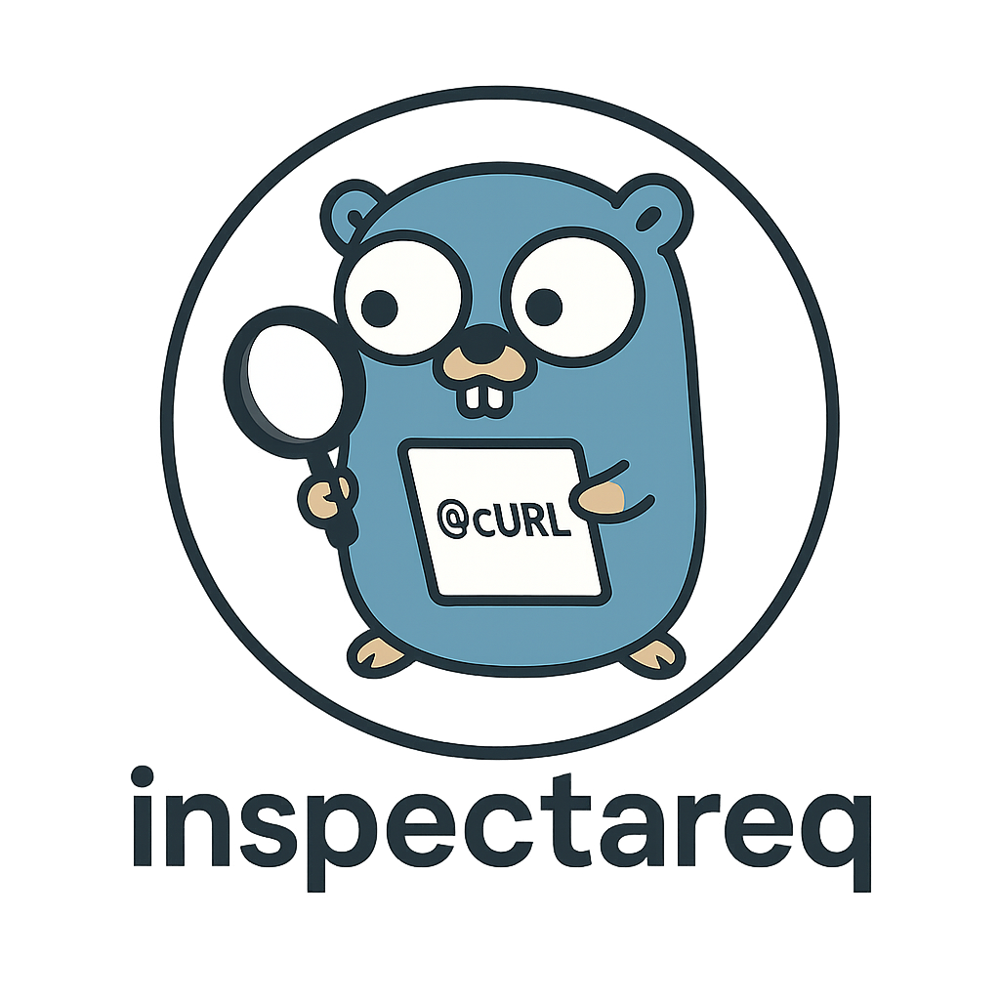

<p align="center">
  
  <h3 align="center">Inspect a Req</h3>
  <p align="center">Transform http.Requests to a curl or httpie command!</p>
</p>

# Inspect a Req(uest)

This is meant to make debugging http requests in Go easier by printing out curl,
httpie, or possibly other types of shell commands that can be used to debug.

Ever working on an app that's making lots of web calls, and sometimes you just
wanna run curl or httpie to try to recreate whatever your app is doing? Just do
`export DEBUG_CURL=1` and build it right in to your app!

## Usage

```bash
## No environment variables set, so print nothing
❯ go run ./examples/enable-env/

## Print out requests in the curl format
❯ DEBUG_CURL=1 go run ./examples/enable-env/
curl -X POST -H 'Authorization: REDACTED' -H 'Content-Type: application/json' -H 'X-Debug: true' 'https://pie.dev/anything' -d '{"username": "alice", "password": "secret"}'

## Print out requests in the httpie format
❯ DEBUG_HTTPIE=1 go run ./examples/enable-env/
http POST 'https://pie.dev/anything' 'Authorization:REDACTED' 'Content-Type:application/json' 'X-Debug:true' data='{"username": "alice", "password": "secret"}'

## Print out requests in both curl and httpie formats
❯ DEBUG_CURL=1 DEBUG_HTTPIE=1 go run ./examples/enable-env/
curl -X POST -H 'Authorization: REDACTED' -H 'Content-Type: application/json' -H 'X-Debug: true' 'https://pie.dev/anything' -d '{"username": "alice", "password": "secret"}'
http POST 'https://pie.dev/anything' 'Authorization:REDACTED' 'Content-Type:application/json' 'X-Debug:true' data='{"username": "alice", "password": "secret"}'
```
